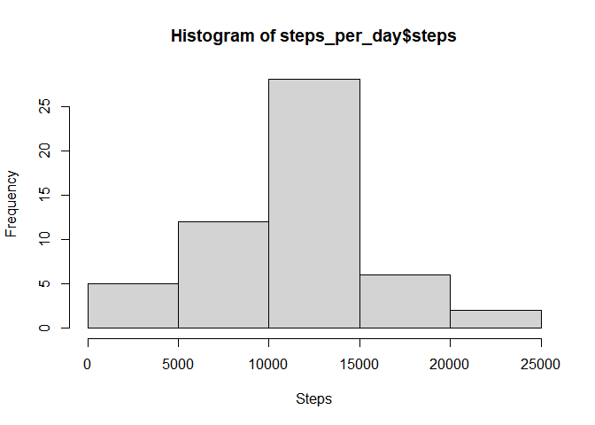
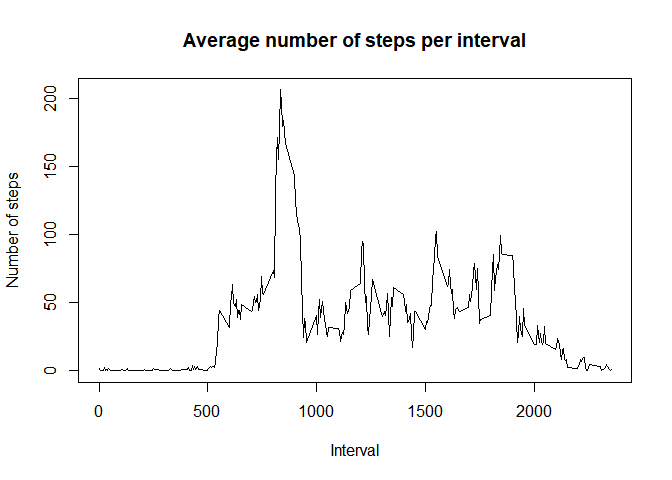
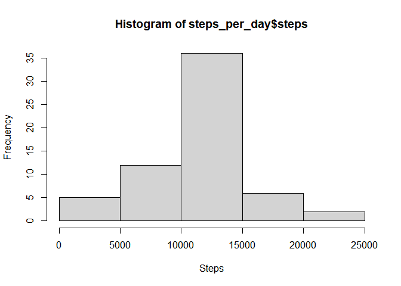
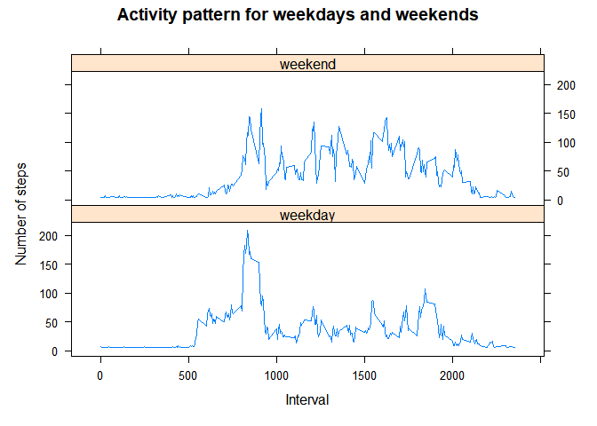

## Loading and preprocessing the data

### Unzip the file

The original repository contains a zip file of the data, as shown below:

```r
dir()
```

```
##  [1] "activity.csv"                  "activity.zip"                 
##  [3] "doc"                           "instructions_fig"             
##  [5] "PA1_template.html"             "PA1_template.md"              
##  [7] "PA1_template.Rmd"              "PA1_template_files"           
##  [9] "README.md"                     "RepData_PeerAssessment1.Rproj"
```
We first unzip the file and examine the contents again:

```r
unzip("activity.zip")
dir()
```

```
##  [1] "activity.csv"                  "activity.zip"                 
##  [3] "doc"                           "instructions_fig"             
##  [5] "PA1_template.html"             "PA1_template.md"              
##  [7] "PA1_template.Rmd"              "PA1_template_files"           
##  [9] "README.md"                     "RepData_PeerAssessment1.Rproj"
```

### Reading the data


```r
library(tidyverse)
```

```
## -- Attaching packages --------------------------------------- tidyverse 1.3.1 --
```

```
## v ggplot2 3.3.5     v purrr   0.3.4
## v tibble  3.1.6     v dplyr   1.0.8
## v tidyr   1.2.0     v stringr 1.4.0
## v readr   2.1.2     v forcats 0.5.1
```

```
## -- Conflicts ------------------------------------------ tidyverse_conflicts() --
## x dplyr::filter() masks stats::filter()
## x dplyr::lag()    masks stats::lag()
```

```r
d <- as_tibble(read_csv("activity.csv"))
```

```
## Rows: 17568 Columns: 3
```

```
## -- Column specification --------------------------------------------------------
## Delimiter: ","
## dbl  (2): steps, interval
## date (1): date
## 
## i Use `spec()` to retrieve the full column specification for this data.
## i Specify the column types or set `show_col_types = FALSE` to quiet this message.
```

```r
d
```

```
## # A tibble: 17,568 x 3
##    steps date       interval
##    <dbl> <date>        <dbl>
##  1    NA 2012-10-01        0
##  2    NA 2012-10-01        5
##  3    NA 2012-10-01       10
##  4    NA 2012-10-01       15
##  5    NA 2012-10-01       20
##  6    NA 2012-10-01       25
##  7    NA 2012-10-01       30
##  8    NA 2012-10-01       35
##  9    NA 2012-10-01       40
## 10    NA 2012-10-01       45
## # ... with 17,558 more rows
```
We see that the data are read in successfully.

## What is mean total number of steps taken per day?


```r
steps_per_day <- d %>% group_by(date) %>% dplyr::summarize(steps=sum(steps))
```
Plot a histogram:

```r
hist(steps_per_day$steps, xlab="Steps")
```

<!-- -->
We see that the person usually walks 10000 to 15000 steps per day.

* Mean steps per day: 10766.19
* Median steps per day: 10765

## What is the average daily activity pattern?

To answer this question we need to look at all the intervals.

```r
mean_steps <- d %>% group_by(interval) %>% dplyr::summarize(mean=mean(steps, na.rm=T))
```
Then make a line plot to look at the activity pattern:

```r
plot(mean_steps$interval, mean_steps$mean, type="l", xlab="Interval", ylab="Number of steps", main="Average number of steps per interval")
```

<!-- -->

```r
ix <- which.max(mean_steps$mean) #index of max steps
```
The interval with the maximum number of steps is 835.

## Imputing missing values

Calculate the total number of missing values:

```r
sum(is.na(d$steps))
```

```
## [1] 2304
```
Impute missing values with the mean, using the impute function from the Hmisc package:

```r
library(Hmisc)
```

```
## Loading required package: lattice
```

```
## Loading required package: survival
```

```
## Loading required package: Formula
```

```
## 
## Attaching package: 'Hmisc'
```

```
## The following objects are masked from 'package:dplyr':
## 
##     src, summarize
```

```
## The following objects are masked from 'package:base':
## 
##     format.pval, units
```

```r
d$steps <- impute(d$steps, fun=mean)
```
Below we repeat the histogram from above to check the effect of imputation.

```r
steps_per_day <- d %>% group_by(date) %>% dplyr::summarize(steps=sum(steps))
```
Plot a histogram:

```r
hist(steps_per_day$steps, xlab="Steps")
```

<!-- -->

* Mean steps per day: 10766.19
* Median steps per day: 10766.19

We can see some effects of the imputation. A more sophisticated imputation strategy would be better.

## Are there differences in activity patterns between weekdays and weekends?

First we create the day type factor.

```r
d$day_type <- as.factor(ifelse(weekdays(d$date)=="Saturday"|weekdays(d$date)=="Sunday", "weekend", "weekday"))
```
Then plot the steps for each day type:

```r
library(lattice)
mean_steps <- d %>% group_by(interval, day_type) %>% dplyr::summarize(mean=mean(steps, na.rm=T))
```

```
## `summarise()` has grouped output by 'interval'. You can override using the
## `.groups` argument.
```

```r
xyplot(mean_steps$mean ~ mean_steps$interval | day_type, data=mean_steps, type="l", ylab = "Number of steps", main="Activity pattern for weekdays and weekends", xlab = "Interval", layout=c(1,2))
```

<!-- -->


